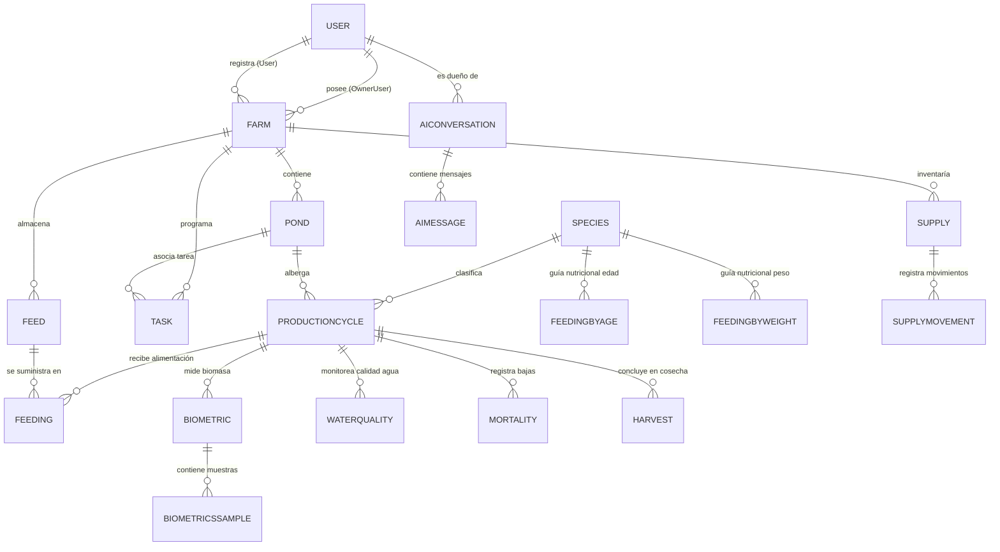

# 03. Modelo de Dominio y Diccionario de Datos (Domain Model)

**Última actualización:** 06 de octubre de 2026  
**Fuente de Verdad:** DDL Oficial provisto para la base de datos MySQL (`PisciDataDB`), con restricciones de integridad (CHECK, UNIQUE, CASCADE/RESTRICT) implementadas a nivel motor.  
**Propósito:** Describir la estructura conceptual y relacional de los datos del sistema PisciData, detallando las 19 entidades, sus atributos, tipos de datos, restricciones y cardinalidad.

---

## 1. Diagrama Entidad-Relación (Mermaid ERD)

---

## 2. Agrupación Funcional del Dominio

Las 19 entidades del sistema se dividen en 6 módulos de negocio:

1. **Gestión de Infraestructura y Tenencia:** `User`, `Farm`, `Pond`.
2. **Ciclos Productivos y Especies:** `Species`, `Productioncycle`, `Harvest`.
3. **Nutrición y Alimentación:** `Feed`, `Feeding`, `Feedingbyage`, `Feedingbyweight`.
4. **Monitoreo Biológico y Calidad de Agua:** `Biometric`, `Biometricssample`, `Mortality`, `Waterquality`.
5. **Inventario y Operaciones de Granja:** `Supply`, `Supplymovement`, `Task`.
6. **Asistente de Inteligencia Artificial:** `Aiconversation`, `Aimessage`.

---

## 3. Restricciones de Integridad y Cascadas (DDL Oficial)

A partir del DDL oficial suministrado, la integridad relacional se delega al motor de base de datos MySQL (y no solo al ORM) mediante:

*   **Restricciones `CHECK`:** Validan dominios en roles (ej. `Role IN ('Admin', 'Owner', 'Technician', 'Worker')`), prioridades, tipos de movimiento, etapas alimentarias, y previenen valores negativos en campos críticos (ej. `QuantityKg >= 0`).
*   **Reglas `UNIQUE`:** Garantizan la unicidad del identificador principal del usuario (teléfono) o de combinaciones clave (ej. `Code` por `FarmId`).
*   **Integridad Referencial (Cascade Rules):**
    *   **Eliminación en Cascada (`ON DELETE CASCADE`):** Entidades fuertemente dependientes, como `BiometricsSample` o `Feeding`, se eliminan en cascada si se elimina su ciclo de producción o muestreo padre.
    *   **Restricción de Eliminación (`ON DELETE RESTRICT`):** Entidades maestras que tienen historial (ej. Catálogo de `Feed` o `Species`) evitan su borrado si están en uso.
    *   **Actualizaciones (`ON UPDATE CASCADE`):** Mantiene sincronía de IDs foráneos ante cambios (aunque las PKs autoincrementales rara vez mutan).
*   **Auditoría (Autogestión):** Campos como `CreatedAt` (`DEFAULT CURRENT_TIMESTAMP`) y `UpdatedAt` (`ON UPDATE CURRENT_TIMESTAMP`) operan automáticamente en el motor de base de datos.

---

## 4. Diccionario de Datos Detallado

### Módulo 1: Infraestructura y Tenencia

#### 3.1. `user` ([`User.cs`](file:///home/javi/Documentos/uni/taller/PisciData/PisciDataBackend/Domain/Models/User.cs))
Representa a los usuarios del sistema (administradores, técnicos, operarios).
* `Id` (`INT`, PK, Auto-increment): Identificador único.
* `FirstName` (`VARCHAR(100)`, Not Null): Nombre del usuario.
* `LastName` (`VARCHAR(100)`, Not Null): Apellidos.
* `Phone` (`VARCHAR(20)`, Not Null): Teléfono (identificador principal de cuenta).
* `PasswordHash` (`VARCHAR(255)`, Not Null): Credencial de acceso (actualmente en texto plano, ver `TECH-SEC-01`).
* `Role` (`VARCHAR(30)`, Not Null): Rol en el sistema (`Admin`, `Technician`, `Worker`).
* `LastLoginAt` (`DATETIME`, Nullable): Fecha y hora del último inicio de sesión.
* `CreatedAt` (`DATETIME`, Default `CURRENT_TIMESTAMP`): Fecha de creación.
* `UpdatedAt` (`DATETIME`, Nullable): Fecha de última modificación.
* `IsActive` (`TINYINT(1)`, Default `1`): Estado activo/inactivo (Soft Delete).
* `UserId` (`INT`, Nullable, FK -> `user.Id`): Usuario creador/auditor.

#### 3.2. `farm` ([`Farm.cs`](file:///home/javi/Documentos/uni/taller/PisciData/PisciDataBackend/Domain/Models/Farm.cs))
Unidad productiva o predio acuícola.
* `Id` (`INT`, PK, Auto-increment): Identificador único.
* `OwnerUserId` (`INT`, Not Null, FK -> `user.Id`): Usuario propietario de la granja.
* `Name` (`VARCHAR(150)`, Not Null): Nombre de la granja.
* `Description` (`TEXT`, Nullable): Descripción de la instalación.
* `Address` (`VARCHAR(255)`, Nullable): Ubicación física.
* `Latitude` (`DECIMAL(10,8)`, Nullable): Coordenada geográfica de latitud `[-90, 90]`.
* `Longitude` (`DECIMAL(11,8)`, Nullable): Coordenada geográfica de longitud `[-180, 180]`.
* `CreatedAt`, `UpdatedAt`, `IsActive`, `UserId` (Campos estándar de auditoría).

#### 3.3. `pond` ([`Pond.cs`](file:///home/javi/Documentos/uni/taller/PisciData/PisciDataBackend/Domain/Models/Pond.cs))
Estanque, poza o reservorio de agua donde se siembran peces.
* `Id` (`INT`, PK, Auto-increment): Identificador único.
* `FarmId` (`INT`, Not Null, FK -> `farm.Id`): Granja a la que pertenece el estanque.
* `Code` (`VARCHAR(50)`, Not Null): Código o identificador interno (ej. `EST-01`).
* `Name` (`VARCHAR(100)`, Nullable): Nombre descriptivo.
* `Shape` (`VARCHAR(50)`, Nullable): Forma física (Circular, Rectangular, etc.).
* `Width` (`DECIMAL(8,2)`, Nullable): Ancho en metros.
* `Length` (`DECIMAL(8,2)`, Nullable): Largo en metros.
* `Diameter` (`DECIMAL(8,2)`, Nullable): Diámetro en metros (para circulares).
* `Depth` (`DECIMAL(8,2)`, Nullable): Profundidad promedio en metros.
* `Area` (`DECIMAL(10,2)`, Nullable): Área superficial en $m^2$.
* `Description`, `CreatedAt`, `UpdatedAt`, `IsActive`, `UserId`.

---

### Módulo 2: Ciclos Productivos y Especies

#### 3.4. `species` ([`Species.cs`](file:///home/javi/Documentos/uni/taller/PisciData/PisciDataBackend/Domain/Models/Species.cs)) - *Sin API*
Especie de pez cultivada (ej. Trucha arcoíris, Tilapia del Nilo, Pacú).
* `Id` (`INT`, PK, Auto-increment).
* `CommonName` (`VARCHAR(100)`, Not Null): Nombre común comercial.
* `ScientificName` (`VARCHAR(150)`, Nullable): Nombre taxonómico (ej. *Oncorhynchus mykiss*).
* `Description` (`TEXT`, Nullable): Notas biológicas y requerimientos.
* `CreatedAt`, `UpdatedAt`, `IsActive`, `UserId`.

#### 3.5. `productioncycle` ([`Productioncycle.cs`](file:///home/javi/Documentos/uni/taller/PisciData/PisciDataBackend/Domain/Models/Productioncycle.cs))
Lote de producción desde la siembra hasta la cosecha en un estanque.
* `Id` (`INT`, PK, Auto-increment).
* `PondId` (`INT`, Not Null, FK -> `pond.Id`): Estanque asignado.
* `SpeciesId` (`INT`, Not Null, FK -> `species.Id`): Especie sembrada.
* `StartDate` (`DATE`, Not Null): Fecha de siembra/inicio del ciclo.
* `EndDate` (`DATE`, Nullable): Fecha de finalización/cosecha total.
* `InitialFishCount` (`INT`, Nullable): Cantidad de alevines sembrados.
* `InitialAverageWeightGrams` (`DECIMAL(8,2)`, Nullable): Peso promedio inicial en gramos.
* `InitialAgeDays` (`INT`, Nullable): Edad en días al momento de la siembra.
* `Observations`, `CreatedAt`, `UpdatedAt`, `IsActive`, `UserId`.

#### 3.6. `harvest` ([`Harvest.cs`](file:///home/javi/Documentos/uni/taller/PisciData/PisciDataBackend/Domain/Models/Harvest.cs)) - *Sin API*
Cosecha parcial o total de peces de un ciclo.
* `Id` (`INT`, PK, Auto-increment).
* `ProductionCycleId` (`INT`, Not Null, FK -> `productioncycle.Id`).
* `HarvestDate` (`DATE`, Not Null): Fecha de cosecha.
* `FishCount` (`INT`, Not Null): Número de peces cosechados.
* `TotalWeightKg` (`DECIMAL(10,2)`, Nullable): Peso total cosechado en Kg.
* `AverageWeightGrams` (`DECIMAL(8,2)`, Nullable): Peso unitario promedio en gramos.
* `HarvestType` (`VARCHAR(50)`, Nullable): Tipo de cosecha (Parcial, Total).
* `Observations`, `CreatedAt`, `UpdatedAt`, `IsActive`, `UserId`.

---

### Módulo 3: Nutrición y Alimentación

#### 3.7. `feed` ([`Feed.cs`](file:///home/javi/Documentos/uni/taller/PisciData/PisciDataBackend/Domain/Models/Feed.cs))
Tipo o marca de alimento balanceado para peces.
* `Id` (`INT`, PK, Auto-increment).
* `FarmId` (`INT`, Not Null, FK -> `farm.Id`).
* `Brand` (`VARCHAR(100)`, Not Null): Fabricante o marca.
* `ProductName` (`VARCHAR(150)`, Nullable): Nombre comercial.
* `Phase` (`VARCHAR(50)`, Nullable): Etapa biológica (Inicio, Crecimiento, Engorde, Acabado).
* `ProteinPercentage` (`DECIMAL(5,2)`, Nullable): % de proteína cruda.
* `PelletSizeMm` (`DECIMAL(4,2)`, Nullable): Calibre del pellet en milímetros.
* `StockKg` (`DECIMAL(10,2)`, Nullable): Existencia actual en almacén.
* `MinimumStockKg` (`DECIMAL(10,2)`, Nullable): Umbral mínimo de alerta.
* `CreatedAt`, `UpdatedAt`, `IsActive`, `UserId`.

#### 3.8. `feeding` ([`Feeding.cs`](file:///home/javi/Documentos/uni/taller/PisciData/PisciDataBackend/Domain/Models/Feeding.cs))
Evento individual de suministro de comida a un estanque.
* `Id` (`INT`, PK, Auto-increment).
* `ProductionCycleId` (`INT`, Not Null, FK -> `productioncycle.Id`).
* `FeedId` (`INT`, Not Null, FK -> `feed.Id`).
* `FeedingDate` (`DATE`, Not Null): Día de la ración.
* `FeedingTime` (`TIME`, Not Null): Hora del suministro.
* `QuantityKg` (`DECIMAL(8,2)`, Not Null): Cantidad servida en kilogramos.
* `MealNumber` (`INT`, Nullable): Número de toma del día (1ra, 2da, 3ra toma).
* `Behavior` (`VARCHAR(100)`, Nullable): Comportamiento de ingesta (Voraz, Lento, Pasivo).
* `Observations`, `CreatedAt`, `UpdatedAt`, `IsActive`, `UserId`.

#### 3.9. `feedingbyage` ([`Feedingbyage.cs`](file:///home/javi/Documentos/uni/taller/PisciData/PisciDataBackend/Domain/Models/Feedingbyage.cs)) - *Sin API*
Tabla guía de nutrición por edad cronológica de la especie.
* `SpeciesId` (`INT`, FK -> `species.Id`), `MinimumAgeDays` (`INT`), `MaximumAgeDays` (`INT`), `ApproximatedFishWeightGrams` (`DECIMAL`), `FeedingRatePercentage` (`DECIMAL`), `ProteinPercentage` (`DECIMAL`), `PelletSizeMm` (`DECIMAL`), `DailyAmountKilo` (`DECIMAL`), `DailyMeals` (`INT`).

#### 3.10. `feedingbyweight` ([`Feedingbyweight.cs`](file:///home/javi/Documentos/uni/taller/PisciData/PisciDataBackend/Domain/Models/Feedingbyweight.cs)) - *Sin API*
Tabla guía de nutrición según peso corporal del pez.
* `SpeciesId` (`INT`, FK -> `species.Id`), `MinimumWeightGrams` (`DECIMAL`), `MaximumWeightGrams` (`DECIMAL`), `FeedingRatePercentage` (`DECIMAL`), `ProteinPercentage` (`DECIMAL`), `PelletSizeMm` (`DECIMAL`), `DailyAmountKilo` (`DECIMAL`), `DailyMeals` (`INT`).

---

### Módulo 4: Monitoreo Biológico y Calidad de Agua

#### 3.11. `biometrics` ([`Biometric.cs`](file:///home/javi/Documentos/uni/taller/PisciData/PisciDataBackend/Domain/Models/Biometric.cs))
Registro de muestreo general periódico de peso y talla.
* `Id` (`INT`, PK, Auto-increment).
* `ProductionCycleId` (`INT`, Not Null, FK -> `productioncycle.Id`).
* `MeasurementDate` (`DATE`, Not Null): Fecha del muestreo.
* `AverageWeightGrams` (`DECIMAL(10,2)`, Nullable): Peso promedio obtenido en gramos.
* `BiomassKg` (`DECIMAL(12,3)`, Nullable): Biomasa total calculada en estanque ($Kg$).
* `CalculatedFeedKg` (`DECIMAL(12,3)`, Nullable): Ración diaria sugerida calculada ($Kg$).
* `HealthStatus` (`VARCHAR(100)`, Nullable): Estado sanitario general.
* `Observations`, `CreatedAt`, `UpdatedAt`, `IsActive`, `UserId`.

#### 3.12. `biometricssample` ([`Biometricssample.cs`](file:///home/javi/Documentos/uni/taller/PisciData/PisciDataBackend/Domain/Models/Biometricssample.cs))
Submuestras tomadas en cubeta durante el pesaje volumétrico.
* `Id` (`INT`, PK, Auto-increment).
* `BiometricsId` (`INT`, Not Null, FK -> `biometrics.Id`).
* `SampleNumber` (`INT`, Not Null): Número de cubeta/muestra (1, 2, 3...).
* `BucketWaterWeightKg` (`DECIMAL(8,2)`, Nullable): Tara (peso cubeta + agua).
* `BucketWithFishWeightKg` (`DECIMAL(8,2)`, Nullable): Peso total (cubeta + agua + peces).
* `FishCount` (`INT`, Not Null): Conteo de peces en la muestra.
* `TotalFishWeightKg` (`DECIMAL(8,2)`, Nullable): Peso neto de peces (Diferencial).
* `AverageWeightGrams` (`DECIMAL(8,2)`, Nullable): Peso unitario promedio de la muestra.
* `CreatedAt`, `UpdatedAt`, `IsActive`, `UserId`.

#### 3.13. `waterquality` ([`Waterquality.cs`](file:///home/javi/Documentos/uni/taller/PisciData/PisciDataBackend/Domain/Models/Waterquality.cs)) - *Sin API*
Monitoreo de parámetros fisicoquímicos del agua.
* `Id` (`INT`, PK, Auto-increment).
* `ProductionCycleId` (`INT`, Not Null, FK -> `productioncycle.Id`).
* `MeasurementDate` (`DATE`, Not Null): Fecha de medición.
* `MeasurementTime` (`TIME`, Not Null): Hora de medición.
* `TransparencyCm` (`DECIMAL(6,2)`, Nullable): Transparencia con disco Secchi ($cm$).
* `TemperatureC` (`DECIMAL(5,2)`, Nullable): Temperatura del agua en $^\circ C$.
* `Ph` (`DECIMAL(4,2)`, Nullable): Potencial de hidrógeno ($pH$).
* `DissolvedOxygen` (`DECIMAL(5,2)`, Nullable): Oxígeno disuelto en $mg/L$ o $ppm$.
* `Observations`, `CreatedAt`, `UpdatedAt`, `IsActive`, `UserId`.

#### 3.14. `mortality` ([`Mortality.cs`](file:///home/javi/Documentos/uni/taller/PisciData/PisciDataBackend/Domain/Models/Mortality.cs)) - *Sin API*
Registro de peces muertos retirados del estanque.
* `Id` (`INT`, PK, Auto-increment).
* `ProductionCycleId` (`INT`, Not Null, FK -> `productioncycle.Id`).
* `MortalityDate` (`DATE`, Not Null): Fecha del suceso.
* `DeadFishCount` (`INT`, Not Null): Cantidad de peces muertos.
* `Cause` (`VARCHAR(150)`, Nullable): Causa presunta (Hipoxia, Depredación, Hongo, etc.).
* `ObservedSigns` (`TEXT`, Nullable): Síntomas clínicos visibles (branquias pálidas, aletas roídas).
* `Observations`, `CreatedAt`, `UpdatedAt`, `IsActive`, `UserId`.

---

### Módulo 5: Inventario y Operaciones

#### 3.15. `supply` ([`Supply.cs`](file:///home/javi/Documentos/uni/taller/PisciData/PisciDataBackend/Domain/Models/Supply.cs))
Insumo general de la granja (redes, desinfectantes, medicamentos, combustible).
* `Id` (`INT`, PK, Auto-increment).
* `FarmId` (`INT`, Not Null, FK -> `farm.Id`).
* `Name` (`VARCHAR(150)`, Not Null): Nombre del insumo.
* `Category` (`VARCHAR(100)`, Nullable): Categoría.
* `Quantity` (`DECIMAL(10,2)`, Not Null): Stock actual.
* `Unit` (`VARCHAR(30)`, Not Null): Unidad de medida (Kg, Litros, Unidades).
* `MinimumStock` (`DECIMAL(10,2)`, Nullable): Punto de reorden.
* `CreatedAt`, `UpdatedAt`, `IsActive`, `UserId`.

#### 3.16. `supplymovement` ([`Supplymovement.cs`](file:///home/javi/Documentos/uni/taller/PisciData/PisciDataBackend/Domain/Models/Supplymovement.cs)) - *Sin API*
Kardex de entradas y salidas de almacén.
* `Id` (`INT`, PK, Auto-increment).
* `SupplyId` (`INT`, Not Null, FK -> `supply.Id`).
* `MovementDate` (`DATETIME`, Not Null): Fecha del movimiento.
* `MovementType` (`VARCHAR(30)`, Not Null): `IN` (Entrada), `OUT` (Salida), `ADJUSTMENT` (Ajuste).
* `Quantity` (`DECIMAL(10,2)`, Not Null): Cantidad movida.
* `Reason` (`VARCHAR(255)`, Nullable): Motivo o justificativo.
* `CreatedAt`, `UpdatedAt`, `IsActive`, `UserId`.

#### 3.17. `task` ([`Task.cs`](file:///home/javi/Documentos/uni/taller/PisciData/PisciDataBackend/Domain/Models/Task.cs)) - *Sin API*
Actividades y labores operativas asignadas al personal.
* `Id` (`INT`, PK, Auto-increment).
* `FarmId` (`INT`, Not Null, FK -> `farm.Id`).
* `PondId` (`INT`, Nullable, FK -> `pond.Id`): Estanque específico si aplica.
* `Title` (`VARCHAR(200)`, Not Null): Título de la tarea.
* `Description` (`TEXT`, Nullable): Instrucciones de la labor.
* `ScheduledDate` (`DATETIME`, Nullable): Fecha programada.
* `CompletedDate` (`DATETIME`, Nullable): Fecha real de culminación.
* `Priority` (`VARCHAR(30)`, Not Null): Prioridad (Baja, Media, Alta, Urgente).
* `Completed` (`TINYINT(1)`, Not Null, Default `0`): Estado de completitud (booleano).
* `CreatedAt`, `UpdatedAt`, `IsActive`, `UserId`.

---

### Módulo 6: Inteligencia Artificial

#### 3.18. `aiconversation` ([`Aiconversation.cs`](file:///home/javi/Documentos/uni/taller/PisciData/PisciDataBackend/Domain/Models/Aiconversation.cs)) - *Sin API*
Hilo o sesión de chat con el asistente de IA.
* `Id` (`INT`, PK, Auto-increment).
* `OwnerUserId` (`INT`, Not Null, FK -> `user.Id`): Usuario que abrió la consulta.
* `StartDate` (`DATETIME`, Not Null, Default `CURRENT_TIMESTAMP`): Inicio de conversación.
* `LastMessageDate` (`DATETIME`, Nullable): Última actividad en el hilo.
* `Title` (`VARCHAR(255)`, Nullable): Título o tema del hilo.
* `CreatedAt`, `UpdatedAt`, `IsActive`, `UserId`.

#### 3.19. `aimessage` ([`Aimessage.cs`](file:///home/javi/Documentos/uni/taller/PisciData/PisciDataBackend/Domain/Models/Aimessage.cs)) - *Sin API*
Mensaje individual dentro de un hilo de conversación de IA.
* `Id` (`INT`, PK, Auto-increment).
* `AiconversationId` (`INT`, Not Null, FK -> `aiconversation.Id`).
* `Role` (`VARCHAR(30)`, Not Null): Emisor (`user`, `assistant`, `system`).
* `Content` (`TEXT`, Nullable): Texto del mensaje.
* `Transcription` (`TEXT`, Nullable): Transcripción si el origen fue un audio de voz.
* `MessageType` (`VARCHAR(30)`, Not Null, Default `'TEXT'`): Tipo (`TEXT`, `AUDIO`).
* `MessageDate` (`DATETIME`, Default `CURRENT_TIMESTAMP`): Momento del mensaje.
* `CreatedAt`, `UpdatedAt`, `IsActive`, `UserId`.
