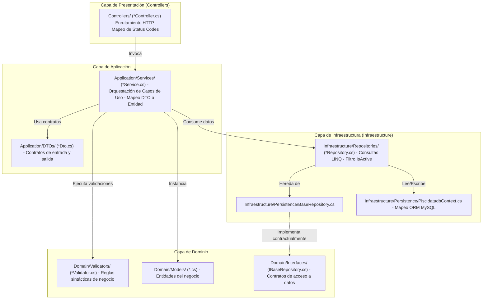
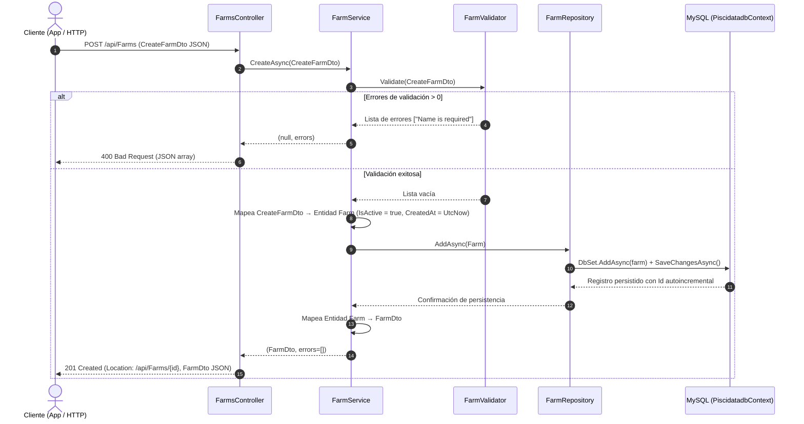

# 04. Arquitectura del Sistema (System Architecture)

**Última actualización:** 06 de octubre de 2026  
**Propósito:** Describir la topología física, los contenedores del sistema, la arquitectura en capas del backend y el ciclo de vida de procesamiento de datos basándose en el diseño aprobado para el repositorio.

> **Definición de Baseline SDD:**
> «"docs/" representa la especificación y el estado conocido del proyecto. La especificación define la intención del sistema; el código representa el estado actual de implementación. Las divergencias entre ambos son defectos de implementación o elementos pendientes, no cambios implícitos de la especificación.»
> «La documentación no declara que una funcionalidad esté verificada únicamente porque exista código relacionado con ella.»

---

## 1. Topología Global y Contenedores (C4 Container Diagram)

El sistema opera bajo un modelo distribuido desacoplado **API-First / Cliente-Servidor**:

```mermaid
graph TD
    subgraph Clientes ["Capa de Presentación (UI)"]
        MobileApp["PisciDataFrontend (App Móvil) - Kotlin Multiplatform + Compose"]
    end

    subgraph IA ["Capa de Inteligencia Artificial Local"]
        STT["Whisper (STT) - Conversión de Audio a Texto"]
        LLM["Ollama (LLM) - Agente Inteligente / MCP Client"]
    end

    subgraph Servidores ["Servidores del Sistema"]
        API["PisciDataBackend - ASP.NET Core (.NET 10) - REST API HTTP:5007"]
        MCPServer["PisciDataMCP - .NET Console App - Middleware de Herramientas MCP"]
    end

    subgraph Almacenamiento ["Capa de Datos"]
        DB[("MySQL Database 8.0+ - piscidatadb")]
    end

    MobileApp -->|HTTP REST / JSON| API
    MobileApp -->|Flujo de Voz (Audio)| STT
    MobileApp -->|Interacción de Texto| LLM
    STT -->|Texto Transcrito| LLM
    LLM -->|Llamadas a Herramientas (JSON-RPC)| MCPServer
    API -->|TCP 3306 / EF Core| DB
    MCPServer -->|Ejecución de Operaciones| API
```

---

## 2. Arquitectura Interna del Backend (`PisciDataBackend`)

El backend implementa una **Arquitectura en Capas (Layered Architecture)** con separación de responsabilidades:



---

## 3. Análisis de Inversión de Dependencias (DIP) y Acoplamiento

> [!NOTE]
> **Diagnóstico Arquitectónico:**  
> El sistema posee los elementos estructurales de *Clean Architecture* (capas de Dominio e Interfaces aisladas), pero su implementación actual corresponde a una **Arquitectura en Capas clásica**.

### Evidencia en el Código:
1. **Definición de Interfaz:** Existe [`IBaseRepository<T>`](file:///home/javi/Documentos/uni/taller/PisciData/PisciDataBackend/Domain/Interfaces/IBaseRepository.cs) en `Domain/Interfaces/`.
2. **Implementación de Repositorio:** [`BaseRepository<T>`](file:///home/javi/Documentos/uni/taller/PisciData/PisciDataBackend/Infraestructure/Persistence/BaseRepository.cs) implementa formalmente `IBaseRepository<T>`.
3. **Punto de Acoplamiento:** Los servicios no reciben `IBaseRepository<T>` ni interfaces específicas (`IFarmRepository`). En su lugar, inyectan directamente las clases concretas en sus constructores:
   ```csharp
   // FarmService.cs (Línea 12)
   public FarmService(FarmRepository farmRepository)
   ```
4. **Contenedor IoC:** En [`Program.cs`](file:///home/javi/Documentos/uni/taller/PisciData/PisciDataBackend/Program.cs#L22-L41) los repositorios se registran por tipo concreto (`builder.Services.AddScoped<FarmRepository>();`).

*Impacto:* Para pruebas unitarias con mocks o sustitución de motor de persistencia, se requiere cerrar la inversión de dependencias inyectando abstracciones (`IFarmRepository`).

---

## 4. Ciclo de Vida de una Petición HTTP (Request Lifecycle)

Secuencia de ejecución para una operación de creación (`POST /api/Farms`):



---

## 5. Estrategia de Persistencia de Datos

1. **ORM y Proveedor:** Entity Framework Core sobre MySQL mediante el paquete `Microting.EntityFrameworkCore.MySql` versión `10.0.12`.
2. **Generación del Contexto:** Generado mediante *Reverse Engineering* (`dotnet ef dbcontext scaffold`) a partir de una base de datos MySQL existente.
3. **Mapeo de Tipos:**
   * Tipos fecha modernos de .NET: `DateOnly` y `TimeOnly` mapeados a `DATE` y `TIME` de MySQL (utilizados en `feeding`, `biometrics`, `waterquality`).
   * Precisión decimal explícita: Coordenadas geográficas (`DECIMAL(10,8)` y `DECIMAL(11,8)`), biomasas (`DECIMAL(12,3)`), pesos de cubeta (`DECIMAL(8,2)`).
4. **Ciclo de Borrado:**
   * **Soft Delete:** Implementado en `Farm` y `User` mediante la columna `IsActive` y actualización de `UpdatedAt`.
   * **Hard Delete:** Ejecutado en las 7 entidades restantes a través del método genérico de `BaseRepository.cs` (`_dbSet.Remove(entity)`).
